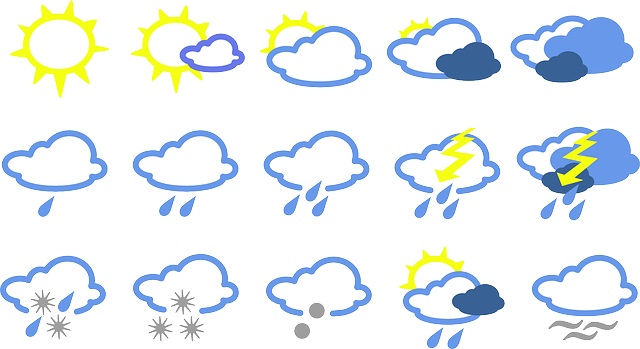

# sqlalchemy-challenge UofT Bootcamp

## Project Overview
This project utilizes SQLAlchemy to analyze climate data from a SQLite database. The goal is to extract meaningful insights from weather station data and create a Flask API to serve climate-related queries.

## Table of Contents
1. Project Overview
2. Technologies Used
3. Setup Instructions
4. Database Tables
5. Data Analysis
6. Folder Structure
7. References

## Technologies Used
* Python
* SQLAlchemy
* SQLite
* Flask
* Pandas
* Matplotlib
* Jupyter Notebook

## Setup Instructions

* Clone this repository: git clone https://github.com/yourusername/sqlalchemy-challenge.git

* Navigate to the project directory: cd sqlalchemy-challenge

* Install dependencies

* Launch Jupyter Notebook for data exploration: jupyter notebook

* Run the Flask API: python app.py

## Database Tables

The database consists of two main tables:

Measurement: Contains climate data such as temperature and precipitation.

* id: Primary key

* station: Weather station ID

* date: Recorded date

* prcp: Precipitation value

* tobs: Temperature observations

Station: Contains information about weather stations.

* id: Primary key

* station: Unique station ID

* name: Station name

* latitude, longitude: Geographical coordinates

* elevation: Elevation level

## Data Analysis

The analysis focuses on:

* Precipitation trends over the past year

* Temperature observations from the most active weather stations

* Calculating temperature statistics (min, max, avg) for a given date range

## Folder Structure

## /project-root

- **image.png**
- **LICENSE.txt**
- **README.md**

- **/SurfsUp**:
  - **app.py**
  - **climate_starter.ipynb**
  - **hawaii.sqlite**
  - **/resources**:
      - **hawaii_measurements.csv**
      - **hawaii_stations.csv**
 
## References

* W3Schools. (n.d.). SQL Quick Reference. Retrieved from https://www.w3schools.com/sql/sql_quickref.asp
* Matplotlib Developers. (n.d.). Matplotlib Documentation. Retrieved from https://matplotlib.org/stable/contents.html
* Pandas Developers. (n.d.). Pandas Documentation. Retrieved from https://pandas.pydata.org/docs/index.html
* ChatGPT – AI-powered assistant for SQL queries and troubleshooting